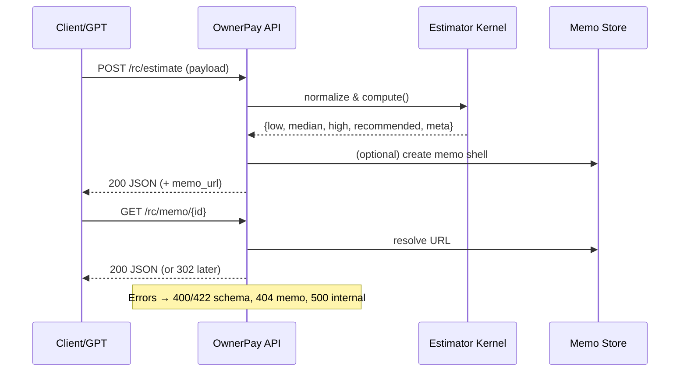

## Routes Diagram


```mermaid
sequenceDiagram
  participant C as Client/GPT
  participant API as OwnerPay API
  participant K as Estimator Kernel
  participant M as Memo Store

  C->>API: POST /rc/estimate (payload)
  API->>K: normalize & compute()
  K-->>API: {low, median, high, recommended, meta}
  API->>M: (optional) create memo shell
  API-->>C: 200 JSON (+ memo_url)

  C->>API: GET /rc/memo/{id}
  API->>M: resolve URL
  API-->>C: 200 JSON (or 302 later)

  Note over API: Errors → 400/422 schema, 404 memo, 500 internal
```

```
ASCII preview
Client -> /rc/estimate -> [API] -> [Kernel] -> API -> (Memo shell) -> Client
Client -> /rc/memo/{id} -> [API] -> Memo store -> Client
```

